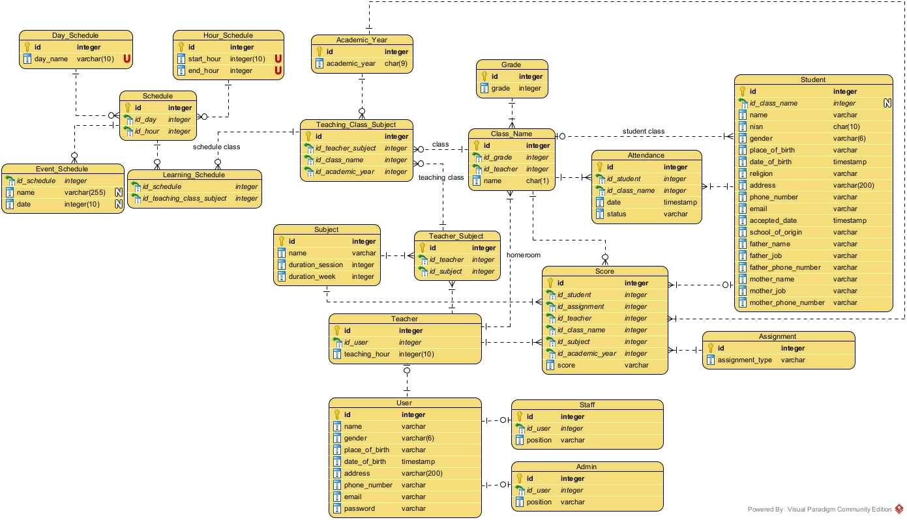

# Setup Project

1. download go from here <https://go.dev/dl/go1.22.2.windows-amd64.msi>
2. Download database management systems [dbeaver](https://dbeaver.io/download/) and postgresql [PostgreSql](https://www.postgresql.org/download/) and install it
3. pull this project from github and locate it in your go workspace where the src folder is located
4. open the project in your favorite IDE
5. open the terminal and run the following command to install the dependencies
    **_install all package_**

    ```bash
    go mod download
    ```

    if you want to clean the package that not used in the project use the following command **(Recommended)**
    **_remove unused package + install all package that called in project_**

    ```bash
    go mod tidy
    ```

6. try to install all package

    ```
    go install
    ```

7. Install all build tools for our development

    ```
    make install-tools
    ```
8. Generate App key Encryption

    ```
    go run database/database.go -key:generate
    ```
9. **IMPORTANT** If u're new on this project try to migrate the database first

    ```bash
    go run database/database.go -migrate
    ```

    if you want to drop all table use the following command

    ```bash
    go run database/database.go -migrate:fresh
    ```

    if you want to seed the database use the following command

    ```bash
    go run database/database.go -seed
    ```

    if you want to generate the app_key for auth use the following command

    ```bash
    go run database/database.go -key:generate
    ```

10. run the project using the following command

- Run Project with CompileDaemon **(RECOMMENDED)**

    ```bash
    CompileDaemon -command="./edulink-api"
    ```

- Build The Project And Host It

    ```bash
    go run main.go
    ```

- Run workflows locally using `act` and `docker`
    see the workflow list in `.github/workflows` and run the workflow using the following command

    ```bash
    act --list
    ```

    run job locally using the following command

    ```bash
    act -j <job_name>
    ```

- ERD Diagram for this application
    


# Package of this project

1. Framework: [Gin](https://gin-gonic.com/docs/quickstart/)
2. Golang ORM: [GORM Postgres](https://gorm.io/docs/connecting_to_the_database.html#PostgreSQL)
3. Database:
    - PostgreeSQL main: [postgresql](https://www.postgresql.org/download/)
    - PostgreeSQL tools: [dbeaver](https://dbeaver.io/download/)
    - PostgreeSQL driver: [jdbc](https://jdbc.postgresql.org/download/)
4. env: [godotenv](https://github.com/joho/godotenv)
5. compiler: go with [CompileDaemon](https://github.com/githubnemo/CompileDaemon)
6. session: [gorilla session](https://github.com/gorilla/sessions)
7. encryption: [golang crypto bcrypt](https://pkg.go.dev/golang.org/x/crypto/bcrypt)
8. token: [JWT](https://jwt.io/)
9. Deploy: [Docker](https://www.docker.com/) and [Vercel](https://vercel.com/)
